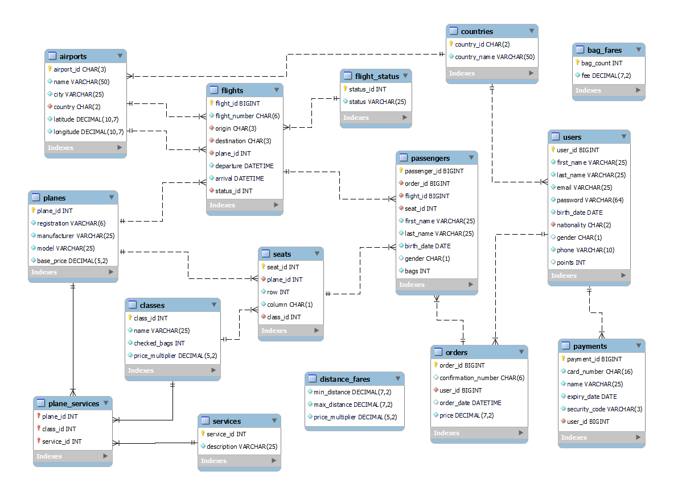

# Flyme WebApp

---
### Airline Reservation System JavaEE WebApp 
Group 6 Final Project for CSD 4464 – Programming Java EE Term 2023W 

## Requirements
**Functional Requirements:**

- The system should allow the user create an account and request authentication credential to log in.
- The system should allow the user to save their profile information
- Flight search for location, destination, and date. One way or two ways
- The app should show a list of all available flights with, price, dates and destinations
- The system should let the user search and booking flights, add bags and other passengers.
- The system should allow the user cancel booked flights.
- ~~Have an admin module to manage available flights~~
- The system should hava a points(mileage) system that get accumulated and rewarded to the user based on the traveled miles.

## Entity-Relationship Diagram 
**Flyme Database Design**

## Views

### Sign Up Page
Inputs:
* First name (Text)
* Last name (Text)
* Date of birth (Date)
* Nationality (Drop down)
* Genre (Drop down)
* Phone (Text)
* Email (Text)
* Password (Password)
* Confirm password (Password)
  * Create account (Button)

### Login Page
Inputs:
* Username (Text)
* Password (Password)
  * Login (Button)

### Profile Page
Initial view: Profile information.

**Menu options:**
* Profile information
    * Username
    * Reward points total
    * Personal information (First name, Last name, Date of birth, Genre, Phone, Email)
      * Edit personal information (Button)

* Trips 1…N (Table)
  * Trip id
  * From
  * To
  * Depart date/time
  * Return date/time
  * Passengers list, class, services included & bag count
  * Plane
    * Cancel trip (Button)
* Payment method (Only one)
  * Card number (Text)
  * Expiry date (2 drop down)
  * Name on card (Text)
  * Security code (Text)
    * Save (Button)
OR
  * Card number
  * Expiry date
  * Name on card
    * Edit payment method (Button)

### Home
  * Login (Button)
  * Sign up (Button)
  * News and articles related to travel destinations.
### Search flight
  * Round trip (Check box)
  * From (Dropdown)
  * Depart date (Date)
  * To (Dropdown)
  * Return date (Optional) (Date)
  * Passengers (Dropdown)
    * Search (Button)
### Flight

* Depart: From - To

[Depart date -2, Depart date -1, Depart date (Selected), Depart date +1, Depart date +2]

(Table)
[Flight option 1…N Plane, Class 1 - Price, Class 2 - Price, Class 3 Price]
* Next (Button)

### Return flight (optional)
* Return: From - To
[Return date -2, Return date -1, Return date (Selected), Return date +1, Return date +2]

(Table)
[Flight option 1…N Plane, Class 1 - Price, Class 2 - Price, Class 3  Price]
* Next (Button)

### Passengers information
* Passenger 1…N (Table)
    * First name (Text)
    * Last name (Text)
    * Date of birth (Date)
    * Genre (Drop down)
    * Bags (Drop down)
      * Next (Button)

### Flight seats + bags
  * Passenger 1…N (Table)
  * Class (Dropdown) Display services available
    * Seat (Drop down)
    * Bags (Drop down)
      * Next (Button)

### Return flight seat + bags (optional)
* Passenger 1…N (Table)
  * Class (Dropdown) Display services available
  * Seat (Drop down)
  * Bags (Drop down)
    * Next (Button)

### Summary
* Flight From – To, depart date
  * Passenger 1…N
  * Full name
      * Class
      * Seat
      * Bags
      * Price
* Return From – To, return date
* Passenger 1…N
  * Full name
  * Class
  * Seat
  * Bags
  * Price
* Sub total
    * Next (Button)

### Pay
* Sub total
* Taxes
* Total
  * Pay (Button)
  * Pay with reward points (Button)
